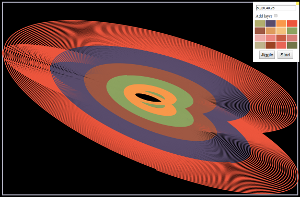
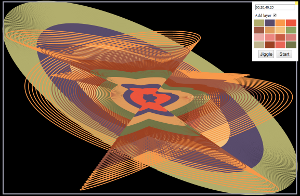

#Canvas Harmonograph

You have probably seen physical versions of these in children's science museums,
like [these](http://www.discoverymuseums.org/hands-exhibits/science-discovery-museum "Science Discovery Museum") [ones](http://www.exploratorium.edu/ "Exploratorium"). 

This version is a quick and dirty 2-Axis, 4-Pendulum harmonograph 
implementation using html5 canvas.

##Usage:

  node server.js
  hit localhost:8000
  Click on stuff!

##Screenshots!

