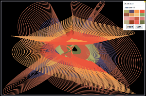

# Canvas Harmonograph

You have probably seen physical versions of these in children's science museums,
like [these](http://www.discoverymuseums.org/hands-exhibits/science-discovery-museum "Science Discovery Museum") [ones](http://www.exploratorium.edu/ "Exploratorium"). 

This version is a quick and dirty 2-Axis, 4-Pendulum harmonograph 
implementation using html5 canvas. 

You can also [play with it live](http://demo.thekearns.org)
* hit jiggle, or enter four numbers to change the shape
* hit start/stop to pause and resume, or to start with new settings
* click on the color palette to change the drawing color
* reload the page to get a different color palette
* click the little yellow triangle to hide the controls
* unselect "add layer" to start with an empty canvas

## Local Usage:

  node server.js  
  hit localhost:8000  
  Click on stuff!  

## Screenshots!

